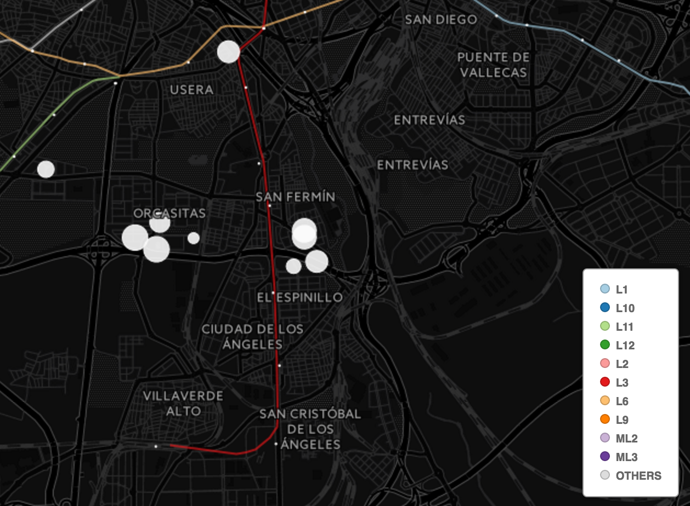

Properties
==========

A small app in Elixir that will filter some [Idealista](http://www.idealista.com/) flats to clean them enough to be sent to [CartoDB](https://cartodb.com/).

Compilation
-----------

    mix escript.build

Prereqs
-------

You will need Idealista and Google Directions API access.

For Idealista, request access here: http://developers.idealista.com/access-request

For Google, go here: https://console.cloud.google.com/apis/api/directions_backend/overview

Usage
-----

Now that you have the access, you will need to set 3 environment vars:

- `IDEALISTA_APIKEY`
- `IDEALISTA_SECRET`
- `GOOGLE_APIKEY`

Now, I am pretty sure that you don't want to search exactly for what I did, so take a look to [`config/cofig.exs`](https://github.com/agonzalezro/properties/blob/master/config/config.exs) and change whatever you need to change.

And finally, run it!

    ./properties

The output of this command is going to be a CSV that you can easily drag&drop on CartoDB.

Result
------

Idealista have some shared datasets on CartoDB, you can use them to for example add underground stations and lines. After some tweaking there you can end up with something like this:

In this example I have heavily filter the flats from Idealista by their own filter params and by the commute time: no more than 40m to work (asking Google for it). You will see a different size of the circle depending on the size of the flat.

TODO
----

- Directly send (and update!) the properties to CartoDB.
- Fix (ask) some of the TODOs.
